<section class="f2f-hero" markdown>

# From Friction to Flow

**A developer story — productivity, trust, and agentic AI at work.**

How GitHub Copilot transformed my daily workflow and amplified my impact —
from chaos and context-switching to calm, deep, high-value work, with a
human still holding the wheel.

  <a class="f2f-btn f2f-btn--solid" href="01-friction-to-flow/">Start the story →</a>
  <a class="f2f-btn f2f-btn--ghost" href="demo/">▶ Watch the demo</a>

</section>

<section class="f2f-intro" markdown>

My days used to be friction: tickets, alerts, context switches, half-finished
branches, an ever-growing surface of things to know. Then the workflow
shifted. I started talking to GitHub Copilot, planning the work with it,
delegating the toil to agents, and keeping the judgement, creativity, and
review for myself. Copilot is an **accelerant** and an **amplifier** — it
doesn't just do the same job faster, it makes work possible that wasn't on
the table before. But I still own the code. Always.

</section>

## Chapters

  <a class="f2f-tile" href="01-friction-to-flow/">
    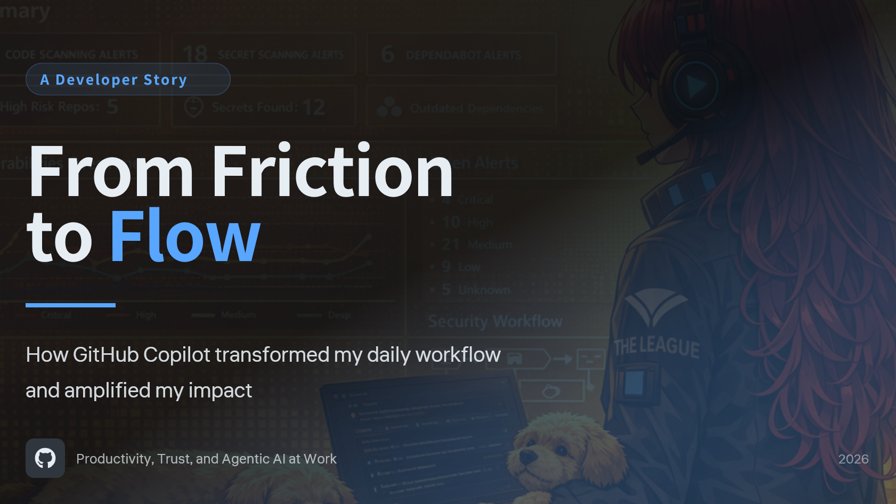
    

      01
      From Friction to Flow
      The opening. One developer, one honest story.
    

  </a>

  <a class="f2f-tile" href="02-daily-friction/">
    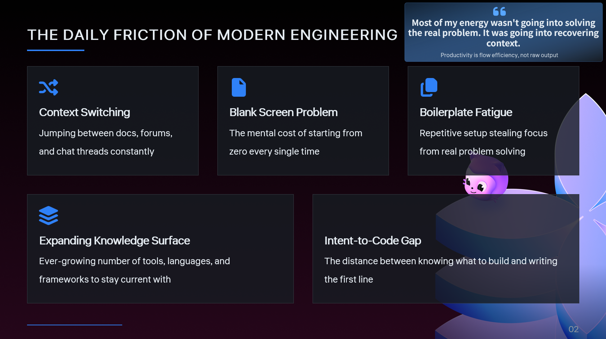
    

      02
      The Daily Friction
      Context switching, blank screens, boilerplate fatigue.
    

  </a>

  <a class="f2f-tile" href="03-more-than-faster-coding/">
    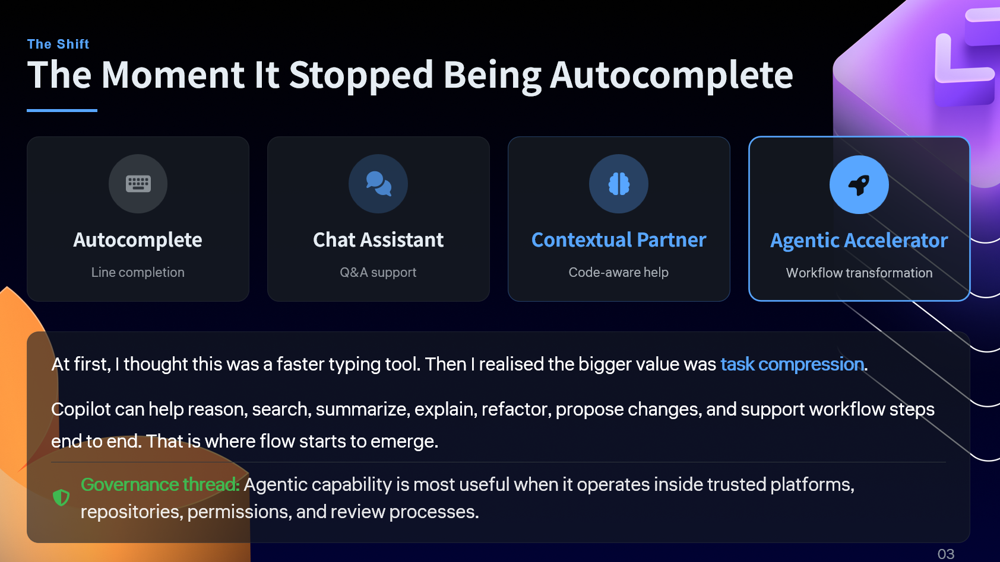
    

      03
      More Than Faster Coding
      Copilot changed what I spend my typing on.
    

  </a>

  <a class="f2f-tile" href="04-defining-flow/">
    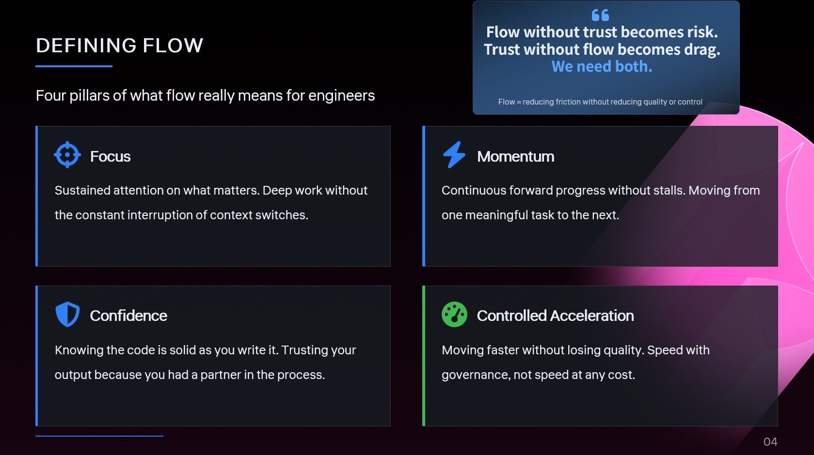
    

      04
      Defining Flow
      Calmer, deeper — not faster, louder.
    

  </a>

  <a class="f2f-tile" href="05-workflow-shift/">
    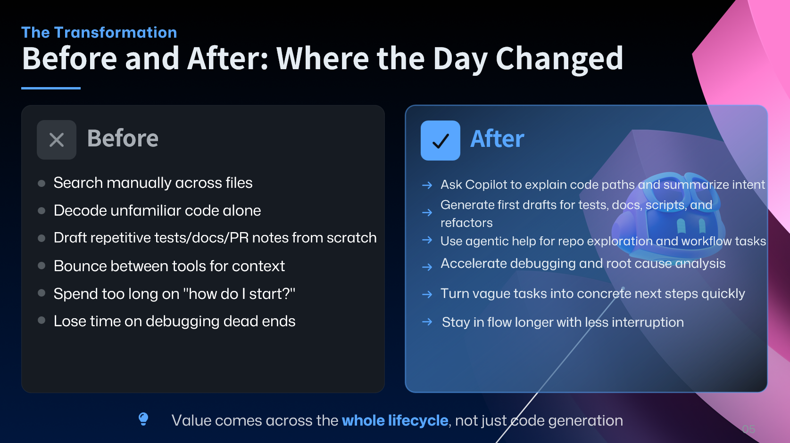
    

      05
      The Workflow Shift
      From author to director.
    

  </a>

  <a class="f2f-tile" href="06-day-in-the-life/">
    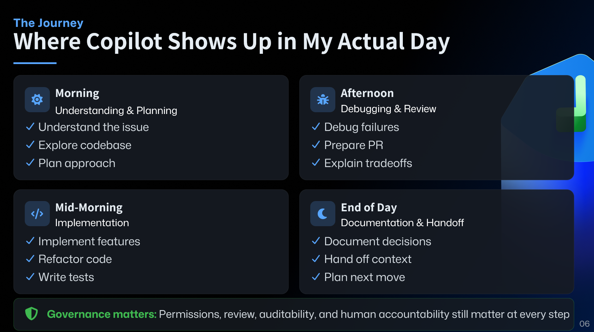
    

      06
      A Day in the Life
      A real Tuesday, not a marketing day.
    

  </a>

  <a class="f2f-tile" href="07-transformation/">
    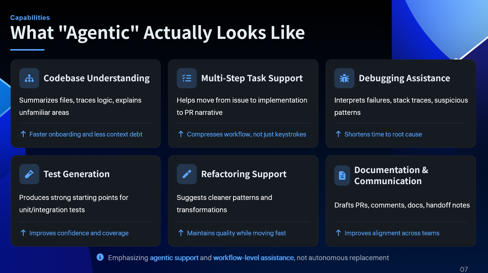
    

      07
      The Transformation
      Before and after — in feel, not features.
    

  </a>

  <a class="f2f-tile" href="08-task-to-momentum/">
    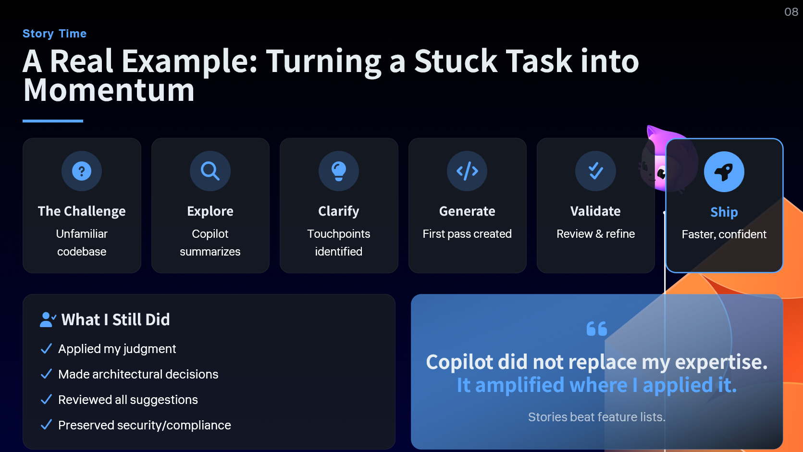
    

      08
      From Task to Momentum
      Plan, delegate, guide, review, ship.
    

  </a>

  <a class="f2f-tile" href="09-scale/">
    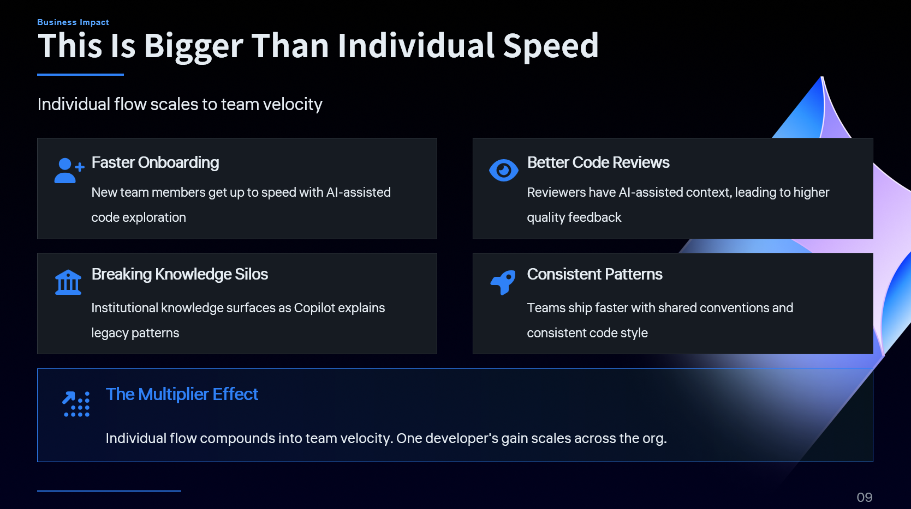
    

      09
      Scale
      Accelerant and amplifier.
    

  </a>

  <a class="f2f-tile" href="10-guardrails/">
    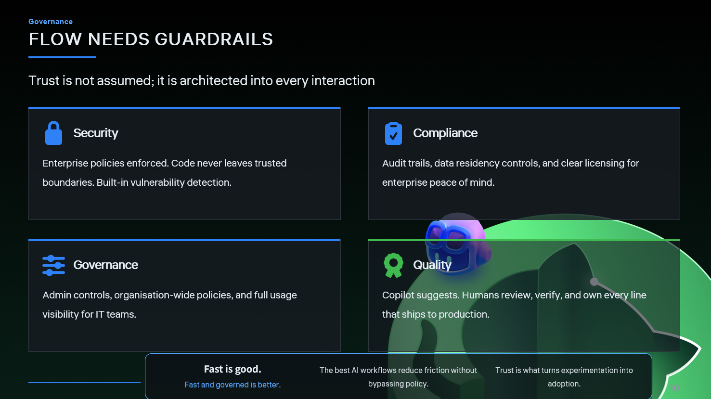
    

      10
      Guardrails
      Speed without oversight is just faster failure.
    

  </a>

  <a class="f2f-tile" href="11-responsible/">
    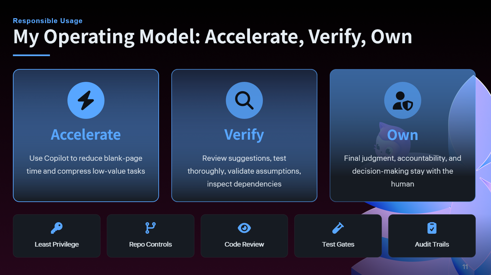
    

      11
      Responsible AI
      I own the code. Not the model. Me.
    

  </a>

  <a class="f2f-tile" href="12-reality-check/">
    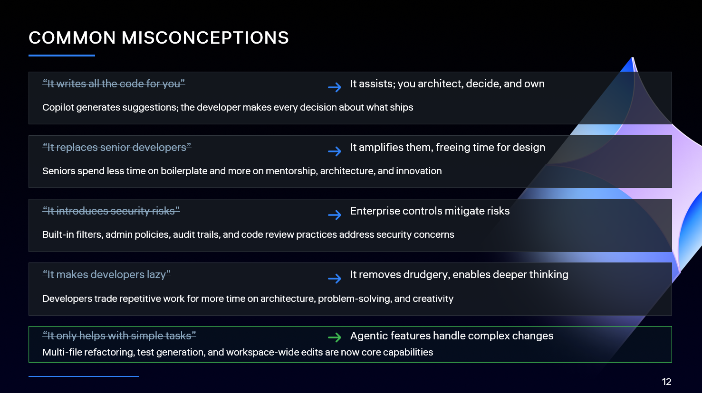
    

      12
      Reality Check
      If you get lazy, you will be replaced.
    

  </a>

  <a class="f2f-tile" href="13-shape-of-work/">
    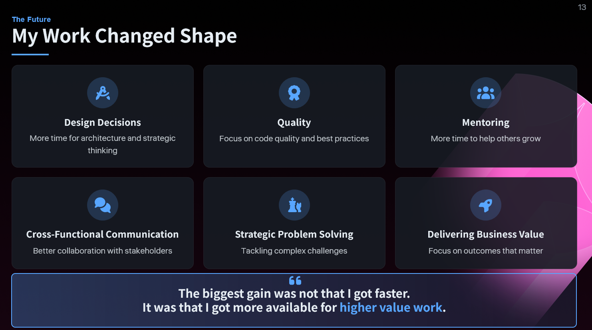
    

      13
      The New Shape of Work
      Same job title. Different job.
    

  </a>

  <a class="f2f-tile" href="14-close/">
    
    

      14
      Close
      Partner, don't replace yourself.
    

  </a>

  <a class="f2f-tile f2f-tile--demo" href="demo/">
    

      ▶
      Demo &amp; Coding Agents
      Two minutes of an agent at work, plus the playbook.
    

  </a>

<section class="f2f-meta" markdown>

### How to use this site

- The talk is **30 minutes, 15 slides** — roughly two minutes per chapter.
- Each chapter opens with its slide as a hero image and contains the spoken
  narrative beneath. Speaker notes live as hidden HTML comments in the
  source.
- Toggle dark / light mode using the icon in the top-right. The palette is
  strict high contrast — pure black / pure white text, no greys.

</section>
